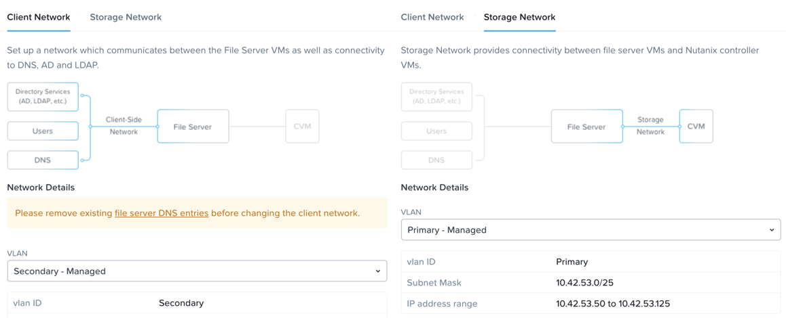

.. title:: Files

-------------
Nutanix Files
-------------

*Die geschätzte Zeit für die Durchführung dieses Labs beträgt 45 Minuten.*

Traditionell war der Dateispeicher ein weiteres Silo innerhalb der IT, das unnötige Komplexität mit sich brachte und unter den gleichen Skalierungsproblemen und dem Mangel an kontinuierlicher Innovation litt, die beim SAN-Speicher auftreten. Nutanix glaubt, dass in der Enterprise Cloud kein Platz für Silos ist. Durch die Annäherung an den Dateispeicher als App, die in Software auf einer bewährten HCI-Lösung ausgeführt wird, bietet Nutanix Files durch One-Click-Management hohe Leistung, Skalierbarkeit und schnelle Innovation.

**In dieser Übung arbeiten Sie mit Nutanix Files, um SMB-Freigaben und NFS-Exporte zu verwalten und die neuen Funktionen für die Bereitstellung von Dateien mit File Analytics zu erkunden.**

Aus Zeitgründen und zur gemeinsamen Nutzung von Infrastrukturressourcen wurde in Ihrem Cluster bereits ein Dateicluster bereitgestellt. Der **BootcampFS** - File Server ist eine Einzelknoteninstanz. Typische **Nutanix Files** Installationen beginnen mit 3 File-Server-VMs und können je nach benötigter Leistung per Scale-up und Scale-out erweitert werden.

**BootcampFS** wurde so konfiguriert, dass es das **primäre** Netzwerk für die Kommunikation mit dem Back-End-Speicher, iSCSI-Verbindungen von **CVM** zu Volume-Groups und das **sekundäre** Netzwerk für die Kommunikation mit Clients, Active Directory, Antiviren-Diensten usw. verwendet.

.. note::
   In Produktionsumgebungen ist es normalerweise wünschenswert, Dateien mit dedizierten virtuellen Netzwerken für den Client- und Speicherverkehr bereitzustellen. Bei Verwendung von zwei Netzwerken verbietet Files im Storage-Netzwerk standardmäßig den Client Traffic, was bedeutet, dass VMs, die dem primären Netzwerk zugewiesen sind, nicht auf Freigaben zugreifen können.

Da Files Nutanix Volume Groups für die Datenspeicherung nutzt, können dieselben zugrunde liegenden Speichervorteile wie Komprimierung, Erasure Coding, Snapshots und Replikation genutzt werden.

In **Prism Element > File Server > File Server**, wählen Sie **BootcampFS** und Klicken Sie auf **Protect**.

   .. figure:: images/10.png

Beachten Sie die Standardzeitpläne für die Self-Service-Wiederherstellung. Diese Funktion steuert den Snapshot-Zeitplan für die frühere Versionen Funktionalität von Windows. Durch die Unterstützung früherer Windows-Versionen können Endbenutzer Änderungen an Dateien rückgängig machen, ohne Speicher- oder Sicherungsadministratoren zu involvieren. Beachten Sie, dass diese lokalen Snapshots den Dateiservercluster nicht vor lokalen Fehlern schützen und dass die Replikation des gesamten Dateiserverclusters auf entfernte Nutanix-Cluster durchgeführt werden kann.

Verwalten von SMB-Freigaben
+++++++++++++++++++++++++++

In dieser Übung erstellen und testen Sie eine SMB-Freigabe, die zur Unterstützung der unstrukturierten Dateidatenanforderungen eines abteilungsübergreifenden Teams für die Fiesta-Anwendung verwendet wird.

Freigabe erstellen
..................

#. In **Prism Element > File Server**, klicken Sie auf **+ Share/Export**.

#. Füllen Sie die folgenden Felder aus:

   - **Name** - *Initialen*\ **-FiestaShare**
   - **Description (Optional)** - Fiesta App Team-Freigabe, die von Produkt-Management, Entwicklung und Marketing verwendet wird.
   - **File Server** - **BootcampFS**
   - **Share Path (Optional)** - Leer lassen. In diesem Feld können Sie einen vorhandenen Pfad angeben, in dem eine verschachtelte Freigabe (nested share) erstellt werden soll.
   - **Max Size (Optional)** - 200 GiB
   - **Select Protocol** - SMB

   .. figure:: images/2.png

   Da dies ein AOS-Cluster mit einem einzelnen Knoten und daher eine einzelne Dateiserver-VM ist, sind alle Freigaben **Standard** - Freigaben . Eine Standardfreigabe (Standard Share) bedeutet, dass alle Verzeichnisse und Dateien der obersten Ebene innerhalb der Freigabe sowie die Verbindungen zur Freigabe von einer einzelnen Dateiserver-VM bereitgestellt werden.

   Wenn dies ein Dateicluster mit drei Knoten oder größer wäre, hätten Sie die Möglichkeit, eine **verteilte** Freigabe (Distributed Share) zu erstellen. Verteilte Freigaben eignen sich für Basisverzeichnisse, Benutzerprofile und Anwendungsordner. Diese Art der Freigabe speichert Verzeichnisse der obersten Ebene auf allen Datei-VMs und gleicht die Verbindungen auf allen Datei-VMs im Dateicluster aus.

#. Klicken Sie auf **Next**.

#. Wählen Sie **Enable Access Based Enumeration** und **Self Service Restore**. Wählen Sie **Blocked File Types** und geben Sie eine durch Kommas getrennte Liste von Erweiterungen wie .flv, .mov ein.

   .. figure:: images/3.png

   .. note::

      **Access Based Enumeration (ABE)** stellt sicher, dass nur Dateien und Ordner, auf die ein bestimmter Benutzer Lesezugriff hat, für diesen Benutzer sichtbar sind. Dies ist normalerweise für Windows-Dateifreigaben aktiviert.

      Mit der **Self Service Restore** können Benutzer die vorherige Windows-Version nutzen, um einzelne Dateien auf der Grundlage von Nutanix-Snapshots problemlos auf frühere Revisionen zurückzusetzen.

      Mit **Blocked File Types** können File Server Administratoren verhindern, dass bestimmte Dateitypen (z.B. große, persönliche Mediendateien) auf Unternehmensfreigaben geschrieben werden. Dies kann pro Server oder pro Freigabe konfiguriert werden, wobei die Einstellungen pro Freigabe die serverweiten Einstellungen überschreiben.

#. Klicken Sie auf **Next**.

#. Überprüfen Sie die **Summary** und klicken Sie auf **Create**.

   .. figure:: images/4.png

   Es ist üblich, dass Freigaben, die von vielen Menschen verwendet werden, Quoten nutzen, um einen fairen Umgang mit Ressourcen sicherzustellen. Nutanix Files bietet die Möglichkeit, entweder weiche oder harte Quoten pro Freigabe für einzelne Benutzer in Active Directory oder für bestimmte Active Directory-Sicherheitsgruppen festzulegen.
   
#. Wählen Sie in **Prism Element > File Server > Share/Export**, Ihren Share aus und klicken Sie **+ Add Quota Policy**.

#. Füllen Sie die folgenden Felder aus und klicken Sie auf **Save**:

   - Wählen Sie **Group**
   - **User or Group** - SSP Developers
   - **Quota** - 10 GiB
   - **Enforcement Type** - Hard Limit

   .. figure:: images/9.png

#. Klicken Sie auf **Save**.

Testen der Freigabe
...................

#. Connect to your *Initials*\ **-WinTools** VM via VM console as a **non-Administrator NTNXLAB** domain account:

   .. note::

      You will not be able to connect using these accounts via RDP.

   - user01 - user25
   - devuser01 - devuser25
   - operator01 - operator25
   - **Password** nutanix/4u

   .. figure:: images/16.png

   .. note::

     The Windows Tools VM has already been joined to the **NTNXLAB.local** domain. You could use any domain joined VM to complete the following steps.

#. Open ``\\BootcampFS.ntnxlab.local\`` in **File Explorer**.

#. Open a browser within your *Initials*\ **-WinTools** desktop and download sample data to populate in your share:

   - **If using a PHX cluster** - http://10.42.194.11/workshop_staging/peer/SampleData_Small.zip
   - **If using a RTP cluster** - http://10.55.251.38/workshop_staging/peer/SampleData_Small.zip

#. Extract the contents of the zip file into your file share.

   .. figure:: images/5.png

   - The **NTNXLAB\\Administrator** user was specified as a Files Administrator during deployment of the Files cluster, giving it read/write access to all shares by default.
   - Managing access for other users is no different than any other SMB share.

..   #. From ``\\BootcampFS.ntnxlab.local\``, right-click *Initials*\ **-FiestaShare > Properties**.

   #. Select the **Security** tab and click **Advanced**.

      .. figure:: images/6.png

   #. Select **Users (BootcampFS\\Users)** and click **Remove**.

   #. Click **Add**.

   #. Click **Select a principal** and specify **Everyone** in the **Object Name** field. Click **OK**.

      .. figure:: images/7.png

   #. Fill out the following fields and click **OK**:

      - **Type** - Allow
      - **Applies to** - This folder only
      - Select **Read & execute**
      - Select **List folder contents**
      - Select **Read**
      - Select **Write**

      .. figure:: images/8.png

   #. Click **OK > OK > OK** to save the permission changes.

   All users will now be able to create folders and files within the *Initials*\ **-FiestaShare** share.

#. Open **PowerShell** and try to create a file with a blocked file type by executing the following command:

   .. code-block:: PowerShell

      New-Item \\BootcampFS\INITIALS-FiestaShare\MyFile.flv

   Observe that creation of the new file is denied.

#. Return to **Prism Element > File Server > Share/Export**, select your share. Review the **Share Details**, **Usage** and **Performance** tabs to understand the high level information available on a per share basis, including the number of files & connections, storage utilization over time, latency, throughput, and IOPS.

   .. figure:: images/11.png

   In the next exercise, you will see how Files can provide further insights into usage of each File Server and Share.

File Analytics
++++++++++++++

In this exercise you will explore the new, integrated File Analytics capabilities available in Nutanix Files, including scanning existing shares, creating anomaly alerts, and reviewing audit details. File Analytics is deployed in minutes as a standalone VM through an automated, One Click operation in Prism Element. This VM has already been deployed and enabled in your environment.

#. In **Prism Element > File Server > File Server**, select **BootcampFS** and click **File Analytics**.

   .. figure:: images/12.png

   .. note::

      File Analytics should already be enabled, but if prompted you will need to provide your Files administrator account, as Analytics will need to be able to scan all shares.

      - **Username**: NTNXLAB\\administrator
      - **Password**: nutanix/4u

      .. figure:: images/old13.png

#. As this is a shared environment, the dashboard will likely already be populated with data from shares created by other users. To scan your newly created share, click :fa:`gear` **> Scan File System**. Select your share and click **Scan**.

   .. figure:: images/14.png

   .. note::

      If your share is not shown, please give it some time to get populated...

#. Close the **Scan File System** window and refresh your browser.

#. You should see the **Data Age**, **File Distribution by Size** and **File Distribution by Type** dashboard panels update.

   .. figure:: images/15.png

   Under....

#. From your *Initials*\ **-WinTools** VM, create some audit trail activity by opening several of the files under **Sample Data**.

   .. note:: You may need to complete a short wizard for OpenOffice if using that application to open a file.

#. Refresh the **Dashboard** page in your browser to see the **Top 5 Active Users**, **Top 5 Accessed Files** and **File Operations** panels update.

   .. figure:: images/17.png

#. To access the audit trail for your user account, click on your user under **Top 5 Active Users**.

   .. figure:: images/17b.png

#. Alternatively, you can select **Audit Trails** from the toolbar and search for your user or a given file.

   .. figure:: images/18.png

   .. note::

      You can use wildcards for your search, for example **.doc**
..
   #. Next, we will create rules to detect anomalous behavior on the File Server. From the toolbar, click :fa:`gear` **> Define Anomaly Rules**.

      .. figure:: images/19.png

      .. note::

         Anomaly Rules are defined on a per File Server basis, so the below rules may have already been created by another user.

   #. Click **Define Anomaly Rules** and create a rule with the following settings:

      - **Events:** Delete
      - **Minimum Operation %:** 1
      - **Minimum Operation Count:** 10
      - **User:** All Users
      - **Type:** Hourly
      - **Interval:** 1

   #. Under **Actions**, click **Save**.

   #. Choose **+ Configure new anomaly** and create an additional rule with the following settings:

      - **Events**: Create
      - **Minimum Operation %**: 1
      - **Minimum Operation Count**: 10
      - **User**: All Users
      - **Type**: Hourly
      - **Interval**: 1

   #. Under **Actions**, click **Save**.

      .. figure:: images/20.png

   #. Click **Save** to exit the **Define Anomaly Rules** window.

   #. To test the anomaly alerts, return to your *Initials*\ **-WinTools** VM and make a second copy of the sample data (via Copy/Paste) within your *Initials*\ **-FiestaShare** share.

   #. Delete the original sample data folders.

      .. figure:: images/21.png

      While waiting for the Anomaly Alerts to populate, next we’ll create a permission denial.

      .. note:: The Anomaly engine runs every 30 minutes.  While this setting is configurable from the File Analytics VM, modifying this variable is outside the scope of this lab.

   #. Create a new directory called *Initials*\ **-MyFolder** in the *Initials*\ **-FiestaShare** share.

   #. Create a text file in the *Initials*\ **-MyFolder** directory and take out your deep seeded worldly frustrations on your for a few moments to populate the file. Save the file as *Initials*\ **-file.txt**.

      .. figure:: images/22.png

   #. Right-click *Initials*\ **-MyFolder > Properties**. Select the **Security** tab and click **Advanced**. Observe that **Users (BootcampFS\\Users)** lack the **Full Control** permission, meaning that they would be unable to delete files owned by other users.

      .. figure:: images/23.png

   #. Open a PowerShell window as another non-Administrator user account by holding **Shift** and right-clicking the **PowerShell** icon in the taskbar and selecting **Run as different user**.

      .. figure:: images/24.png

   #. Change Directories to *Initials*\ **-MyFolder** in the *Initials*\ **-FiestaShare** share.

        .. code-block:: bash

           cd \\BootcampFS.ntnxlab.local\XYZ-FiestaShare\XYZ-MyFolder

   #. Execute the following commands:

        .. code-block:: bash

           cat .\XYZ-file.txt
           rm .\XYZ-file.txt

      .. figure:: images/25.png

   #. Return to **Analytics > Dashboard** and note the **Permission Denials** and **Anomaly Alerts** widgets have updated.

      .. figure:: images/26.png

   #. Under **Permission Denials**, select your user account to view the full **Audit Trail** and observe that the specific file you tried to removed is recorded, along with IP address and timestamp.

      .. figure:: images/27.png

   #. Select **Anomalies** from the toolbar for an overview of detected anomalies.

      .. figure:: images/28.png

File Analytics puts simple, yet powerful information in the hands of storage administrators, allowing them to understand and audit both utilization and access within a Nutanix Files environment.

Using NFS Exports
+++++++++++++++++

In this exercise you will create and test a NFSv4 export, used to support clustered applications, store application data such as logging, or storing other unstructured file data commonly accessed by Linux clients.

Enabling NFS Protocol
.....................

.. note::

   Enabling NFS protocol only needs to be performed once per Files server, and may have already been completed in your environment. If NFS is already enabled, proceed to `Configure User Mappings`_.

#. In **Prism Element > File Server**, select your file server and click **Protocol Management > Directory Services**.

   .. figure:: images/29.png

#. Select **Use NFS Protocol** with **Unmanaged** User Management and Authentication, and click **Update**.

   .. figure:: images/30.png

Creating the Export
...................

#. In **Prism > File Server**, click **+ Share/Export**.

#. Fill out the following fields:

   - **Name** - logs
   - **Description (Optional)** - File share for system logs
   - **File Server** - *Initials*\ **-Files**
   - **Share Path (Optional)** - Leave blank
   - **Max Size (Optional)** - Leave blank
   - **Select Protocol** - NFS

   .. figure:: images/24.png

#. Click **Next**.

#. Fill out the following fields:

   - Select **Enable Self Service Restore**
      - These snapshots appear as a .snapshot directory for NFS clients.
   - **Authentication** - System
   - **Default Access (For All Clients)** - No Access
   - Select **+ Add exceptions**
   - **Clients with Read-Write Access** - *The first 3 octets of your cluster network*\ .* (e.g. 10.38.1.\*)

   .. figure:: images/25.png

   By default an NFS export will allow read/write access to any host that mounts the export, but this can be restricted to specific IPs or IP ranges.

#. Click **Next**.

#. Review the **Summary** and click **Create**.

Testing the Export
..................

You will first provision a CentOS VM to use as a client for your Files export.

.. note:: If you have already deployed the :ref:`linux_tools_vm` as part of another lab, you may use this VM as your NFS client instead.

#. In **Prism > VM > Table**, click **+ Create VM**.

#. Fill out the following fields:

   - **Name** - *Initials*\ -NFS-Client
   - **Description** - CentOS VM for testing Files NFS export
   - **vCPU(s)** - 2
   - **Number of Cores per vCPU** - 1
   - **Memory** - 2 GiB
   - Select **+ Add New Disk**
      - **Operation** - Clone from Image Service
      - **Image** - CentOS
      - Select **Add**
   - Select **Add New NIC**
      - **VLAN Name** - Secondary
      - Select **Add**

#. Click **Save**.

#. Select the *Initials*\ **-NFS-Client** VM and click **Power on**.

#. Note the IP address of the VM in Prism, and connect via SSH using the following credentials:

   - **Username** - root
   - **Password** - nutanix/4u

#. Execute the following:

     .. code-block:: bash

       [root@CentOS ~]# yum install -y nfs-utils #This installs the NFSv4 client
       [root@CentOS ~]# mkdir /filesmnt
       [root@CentOS ~]# mount.nfs4 <Intials>-Files.ntnxlab.local:/ /filesmnt/
       [root@CentOS ~]# df -kh
       Filesystem                      Size  Used Avail Use% Mounted on
       /dev/mapper/centos_centos-root  8.5G  1.7G  6.8G  20% /
       devtmpfs                        1.9G     0  1.9G   0% /dev
       tmpfs                           1.9G     0  1.9G   0% /dev/shm
       tmpfs                           1.9G   17M  1.9G   1% /run
       tmpfs                           1.9G     0  1.9G   0% /sys/fs/cgroup
       /dev/sda1                       494M  141M  353M  29% /boot
       tmpfs                           377M     0  377M   0% /run/user/0
       *intials*-Files.ntnxlab.local:/             1.0T  7.0M  1.0T   1% /afsmnt
       [root@CentOS ~]# ls -l /filesmnt/
       total 1
       drwxrwxrwx. 2 root root 2 Mar  9 18:53 logs

#. Observe that the **logs** directory is mounted in ``/filesmnt/logs``.

#. Reboot the VM and observe the export is no longer mounted. To persist the mount, add it to ``/etc/fstab`` by executing the following:

     .. code-block:: bash

       echo 'Intials-Files.ntnxlab.local:/ /filesmnt nfs4' >> /etc/fstab

#. The following command will add 100 2MB files filled with random data to ``/filesmnt/logs``:

     .. code-block:: bash

       mkdir /filesmnt/logs/host1
       for i in {1..100}; do dd if=/dev/urandom bs=8k count=256 of=/filesmnt/logs/host1/file$i; done

#. Return to **Prism > File Server > Share > logs** to monitor performance and usage.

   Note that the utilization data is updated every 10 minutes.

Multiprotokoll-Freigaben
++++++++++++++++++++++++

Nutanix Files bieten die Möglichkeit, sowohl SMB-Freigaben als auch NFS-Exporte separat bereitzustellen. Jetzt wird jedoch auch die Möglichkeit unterstützt, Multiprotokollzugriff auf dieselbe Freigabe bereitzustellen. In der folgenden Übung konfigurieren Sie Ihre vorhandenen *Initialien*\ **-FiestaShare** so , dass der NFS-Zugriff ermöglicht wird, sodass Entwickler Anwendungsprotokolle an diesen Speicherort umleiten können.

Benutzerzuordnungen konfigurieren
.................................

Eine Nutanix Files-Freigabe hat das Konzept eines nativen und eines nicht nativen Protokolls. Alle Berechtigungen werden mit dem nativen Protokoll angewendet. Alle Zugriffsanforderungen, die das nicht native Protokoll verwenden, erfordern eine Benutzer- oder Gruppenzuordnung zu der von der nativen Seite angewendeten Berechtigung. Es gibt verschiedene Möglichkeiten, Benutzer- und Gruppenzuordnungen anzuwenden, einschließlich regelbasierter, expliziter und Standardzuordnungen. Sie konfigurieren zunächst eine Standardzuordnung.

#. In **Prism Element > File Server**, wählen Sie Ihre Datei - Server und klicken Sie auf **Protocol Management > User Mapping**.

#. Klicken Sie zweimal auf **Next**, um zu dem **Default Mapping**zu gelangen.

#. Von der **Default Mapping** Seite wählen Sie **Deny access to NFS export** und **Deny access to SMB share** als die Standardwerte, sofern keine Zuordnung gefunden wird.

   .. figure:: images/31.png

#. Klicken Sie auf **Next > Save**, um die Standardzuordnung abzuschließen.

#. In **Prism Element > File Server**, wählen Sie Ihren *Initialien*\ **-FiestaShare** nd klicken Sie auf **Update**.

#. Wählen Sie unter **Basics** die Option **Enable multiprotocol access for NFS** aus und klicken Sie auf **Next**.

   .. figure:: images/32.png

#. Wählen Sie unter **Settings > Multiprotocol Access** die Option **Simultaneous access to the same files from both protocols**.

   .. figure:: images/33.png

#. Klicken Sie auf **Next > Save**, um die Aktualisierung der Freigabeeinstellungen abzuschließen.

Testen des Exports
..................

#. Um den NFS-Export zu testen, stellen Sie über SSH eine Verbindung zu Ihrer *Initialien*\ **-LinuxToolsVM** VM her:

   - **User Name** - root
   - **Password** - nutanix/4u

#. Führen Sie die folgenden Befehle aus:

     .. code-block:: bash

       [root@CentOS ~]# yum install -y nfs-utils #This installs the NFSv4 client
       [root@CentOS ~]# mkdir /filesmulti
       [root@CentOS ~]# mount.nfs4 bootcampfs.ntnxlab.local:/<Initials>-FiestaShare /filesmulti
       [root@CentOS ~]# dir /filesmulti
       dir: cannot open directory /filesmulti: Permission denied
       [root@CentOS ~]#

   .. note:: Bei der mount Operation wird zwischen Groß- und Kleinschreibung unterschieden.

Da die Standardzuordnung darin besteht, den Zugriff zu verweigern, wird der Fehler "Permission denied" (Berechtigung verweigert) erwartet. Sie fügen jetzt eine explizite Zuordnung hinzu, um den Zugriff auf den nicht nativen NFS-Protokollbenutzer zu ermöglichen. Wir benötigen die Benutzer-ID (UID), um die explizite Zuordnung zu erstellen.

#. Führen Sie den folgenden Befehl aus und notieren Sie sich die UID:

     .. code-block:: bash

       [root@CentOS ~]# id
       uid=0(root) gid=0(root) groups=0(root)
       [root@CentOS ~]#

#. In **Prism Element > File Server**, wählen Sie Ihre Datei - Server und klicken Sie auf **Protocol Management > User Mapping**.

#. Klicken Sie auf **Next** um zur **Explicit Mapping** zu gelangen.

#. Klicken Sie unter **One-to-onemapping list**, auf **Add manually**.

#. Füllen Sie die folgenden Felder aus:

   - **SMB Name** - NTNXLAB\\devuser01
   - **NFS ID** - UID aus dem vorherigen Schritt (0 wenn root)
   - **User/Group** - User

   .. figure:: images/34.png

#. Klicken Sie unter **Actions** auf **Save**.

#. Klicken Sie auf **Next > Next > Save** um die Aktualisierung Ihrer Zuordnungen abzuschließen.

#. Kehren Sie zu Ihrer SSH-Sitzung *Initialien*\ **-LinuxToolsVM** zurück und versuchen Sie erneut, auf die Freigabe zuzugreifen:

     .. code-block:: bash

       [root@CentOS ~]# dir /filesmulti
       Documents\ -\ Copy  Graphics\ -\ Copy  Pictures\ -\ Copy  Presentations\ -\ Copy  Recordings\ -\ Copy  Technical\ PDFs\ -\ Copy  XYZ-MyFolder
       [root@CentOS ~]#

#. Erstellen Sie in Ihrer SSH-Sitzung eine Textdatei und überprüfen Sie anschließend, ob Sie von Ihrem Windows-Client aus auf die Datei zugreifen können.

Zusammenfassung
+++++++++++++++

Was sind die wichtigsten Dinge, die Sie über **Nutanix Files** wissen sollten?

- Files kann schnell auf vorhandenen Nutanix-Clustern bereitgestellt werden und bietet SMB- und NFS-Speicher für Benutzerfreigaben, Basisverzeichnisse, Abteilungsfreigaben, Anwendungen und andere allgemeine Dateispeicheranforderungen.
- Files ist keine punktuelle Lösung. VM-, Datei-, Block- und Objektspeicher können alle von derselben Plattform mit denselben Verwaltungstools bereitgestellt werden, wodurch Komplexität und Verwaltungssilos reduziert werden.
- Mit der One-Click-Leistungsoptimierung kann Nutanix Files per Scale-up udn Scale-out automatisch angepasst werden werden.
- Mithilfe von File Analytics können Sie besser verstehen, wie Daten von Ihren Organisationen verwendet werden, um Ihre Datenprüfungs-, Datenzugriffsminimierungs- und Compliance-Anforderungen zu erfüllen.
