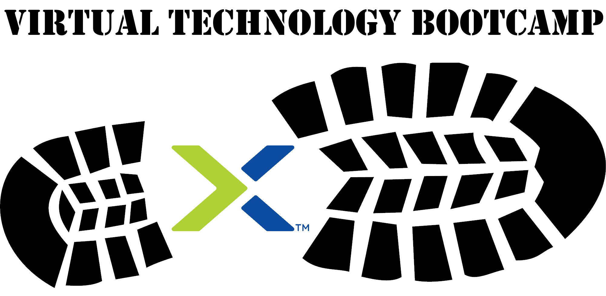

.. title:: Virtual Technology Bootcamp

.. toctree::
   :maxdepth: 2
   :caption: BootCamp Infos
   :hidden:

   Trainer/trainer
   clusteraccess/clusteraccess
   clusterdetails/clusterdetails

.. toctree::
   :maxdepth: 2
   :caption: Labs
   :hidden:

   Lab1/lab1
   Lab2/lab2
   Lab3/lab3
   Lab4/lab4   
   Lab5/lab5   
   Lab6/lab6   
   Lab7/lab7
   
.. toctree::
   :maxdepth: 2
   :caption: Optional
   :hidden:

   files/files
   tools_vms/windows_tools_vm
   tools_vms/linux_tools_vm

.. _getting_started:

-----------------------------------
Herzlich willkommen auf dem Nutanix
-----------------------------------

Dieses Nutanix Technology BootCamp Workbook führt Sie Schritt für Schritt durch die verschiedenen Labs, sodass Sie eine umfassende praktische Einführung in die Nutanix Technologie erhalten. Als Erstes lernen Sie Prism Element kennen und werden mit dessen Funktionen und der Benutzerführung vertraut. Sie werden in diesem Lab Prism Element nutzen um Basis Cluster Administrations-Aufgaben (inkl. Storage und Netzwerk Verwaltung) sowie Basis VM-Deployments und Management-Aufgaben mit Prism und AHV durchzuführen. Weiter werden Sie VM Data Protection Optionen wie Snapshots und Replikationen sowie erweiterte Cluster Funktionalitäten mit Prism Central kennenlernen.

Der Bootcamp Workshop besteht primär aus zwei Hauptbestandteilen:

Teil 1: Theorie
  Genereller Überblick über das Nutanix Portfolio sowie einen theoretischen Einblick in die Nutanix Architektur.

Teil 2: Praxis
  Hier lernen Sie anhand einzelner Labs Schritt für Schritt die zuvor theoretisch vorgestellte Nutanix Architektur kennen. Zusätzlich stehen Ihnen weiterführende optionale Labs zur Verfügung.

**Haben wir Ihr Interesse geweckt? Dann lassen Sie uns beginnen!**

.. note::
   Für den praktischen Teil wird empfohlen entweder individuell auf die Umgebung zuzugreifen oder sich in Teams zusammenzufinden und die Labs gemeinsam durchzuführen.
